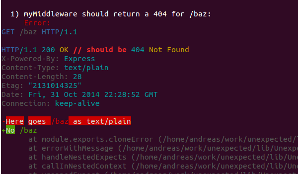

Unexpected-express
==================

Plugin for [Unexpected](https://github.com/sunesimonsen/unexpected) that makes it easy to test [Express.js](https://github.com/visionmedia/express/) middleware. Requires the [unexpected-messy](https://github.com/papandreou/unexpected-messy) plugin.

[](http://badge.fury.io/js/unexpected-express)
[](https://travis-ci.org/papandreou/unexpected-express)
[](https://coveralls.io/r/papandreou/unexpected-express)
[](https://david-dm.org/papandreou/unexpected-express)


Example:

```javascript
var expect = require('unexpected')
    .clone()
    .installPlugin(require('unexpected-messy'))
    .installPlugin(require('unexpected-express'));

function myMiddleware(req, res, next) {
    var contentType = req.headers['accept'] || 'text/plain';
    if (contentType !== 'text/plain' && contentType !== 'text/html') {
        return next(400);
    }
    res.setHeader('Content-Type', contentType);
    var body = 'Here goes ' + req.url + ' as ' + contentType;
    if (contentType === 'text/html') {
        body = '<html>' + body.replace(/&/g, '&amp;').replace(/</g, '&lt;') + '</html>';
    }
    res.send(body);
}

describe('myMiddleware', function (done) {
    it('should handle a simple request', function (done) {
        expect(require('express')().use(myMiddleware), 'to yield exchange', {
            request: {
                url: '/blah',
                headers: {
                    Accept: 'text/plain'
                }
            },
            response: {
                statusCode: 200,
                headers: {
                    'Content-Type': 'text/plain'
                },
                body: 'Here goes /blah as text/plain'
            }
        }, done);
    });
});
```

If you're going to test a piece of middleware extensively, you can create your
own custom assertion around that to increase DRYness and put the request
properties into the subject's spot:

```javascript
expect.addAssertion('to yield a response of', function (expect, subject, value, done) {
    expect(require('express')().use(myMiddleware), 'to yield exchange', {
        request: subject,
        response: value
    }, done);
});

describe('myMiddleware', function () {
    it('should default to text/plain', function (done) {
        expect('/barf', 'to yield a response of', 'Here goes /barf as text/plain', done);
    });

    it('should support text/html', function (done) {
        expect({url: '/quux', headers: {Accept: 'text/html'}}, 'to yield a response of', '<html>Here goes /quux as text/html</html>', done);
    });

    it('should entitify less than and ampersand chars in text/html', function (done) {
        expect({url: '/<h&ey<', headers: {Accept: 'text/html'}}, 'to yield a response of', '<html>Here goes /&lt;h&amp;ey&lt; as text/html</html>', done);
    });

    it('should not entitify in text/plain', function (done) {
        expect('/<hey', 'to yield a response of', 'Here goes /<hey as text/plain', done);
    });

    it('should return a 400 if asked for an unsupported Content-Type', function (done) {
        expect({url: '/something', headers: {Accept: 'text/calendar'}}, 'to yield a response of', {statusCode: 400, errorPassedToNext: true}, done);
    });

    it('should return a 404 for /baz', function (done) {
        expect('/baz', 'to yield a response of', {statusCode: 404, body: 'I could not find /baz'}, done);
    });
});
```

You'll get a nice diff when expectations aren't met:



Additional features:

* Normalizes header names so you don't need to use the ugly lower-case form in the assertions
* The expected response bodies can be specified as either strings, objects (implies JSON), or Buffer instances
* Request bodies can be provided as either strings, objects (implies JSON), Buffer instances, or streams.
* Request body streams that are instances of https://github.com/felixge/node-form-data are special cased to implicitly set the `Content-Type` header correctly.

License
-------

Unexpected-express is licensed under a standard 3-clause BSD license
-- see the `LICENSE` file for details.
